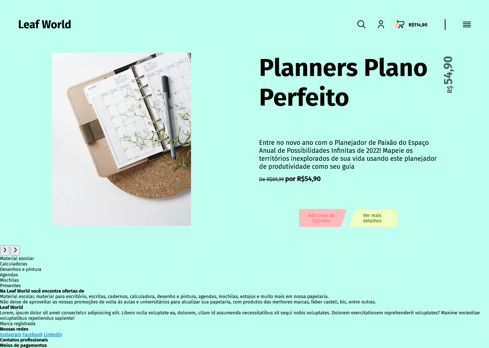

<h1 style="text-align: center;">Portifolio WEB site of stationery store coded with HTML5, CSS3 and Javascript</h1>

>*"The image above is the full page screenshot of the commit started with 7e0381c, if not is the current commit view on github pages, link on description of repository, to see the current version look."*

# The roadmap of additions of features
See on the projects tab of this repository.

# The propourse of each visual element on website
Each element on the interface have a propourse, like the reason to the order of the links on the dropboxes, the color of the buttons, why the elements are on these positions (one below or above outhers and etc), why the products varies positions in relation of the propourse of the vendor.
The motivation for these choices on this page is not yet documented, but in progress...

# Contacts
Take a look at all my contacts on my Github profile:

[Github Profile]([https://https://github.com/Diassisfilho)

# License
And of course:

MIT: https://rem.mit-license.org